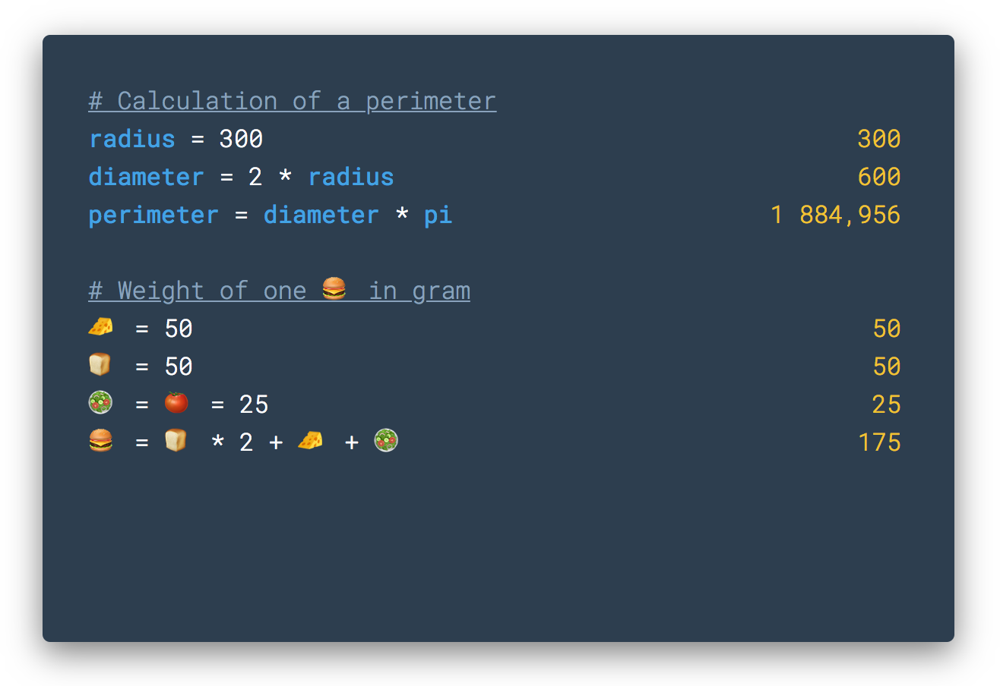

# Calculator

Modern calculator build in HTML, CSS and Javascript. A custom grammar was built with [PEG.js](https://pegjs.org/).

**Demo :** https://camillebaronnet.github.io/calculator/dist/index.html



## Features

- Addition, substraction, multiplication, division
- Custom variables with emoji support, accents and underscore
- Comment line support with hashtag
- Live result for each line
- Line highlight at mouseover of the result
- Syntax highlighting

## Installation

Download or clone the project and run <code>/dist/index.html</code> on modern browser.

## Contribute

Clone the projet and download dependencies :

```
git clone git@github.com:camillebaronnet/calculator.git
cd calculator/
npm install
```

Work on grammar `src/grammar.pegjs` :

```
npm run watch
```

Finally, build before commit :

```
npm run build
```

